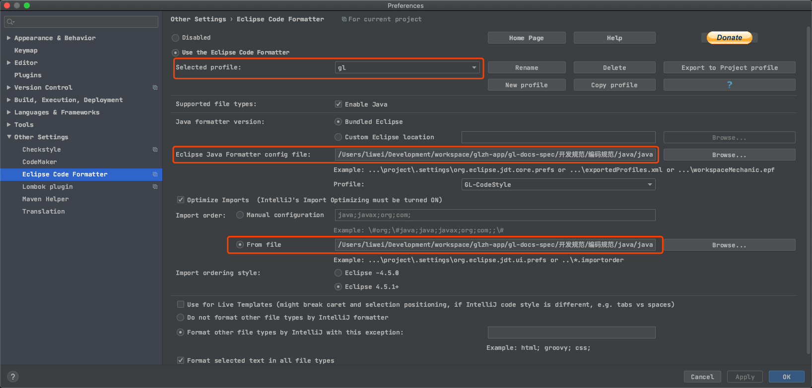

# Java 开发环境准备

## 一、配置基础环境
- [AdoptOpenJDK-11-HotSpot](https://adoptopenjdk.net/)
- Maven 3.0+ ，推荐使用 idea 自带

## 二、版本管理：git
安装参考 [git-scm](https://git-scm.com/download)

**配置 git**
打开 git 终端，输入以下命令配置用户和邮箱 (企业邮箱)
```
# 对你的 commit 操作设置关联的用户名
git config --global user.name "[name]"

# 对你的 commit 操作设置关联的邮箱地址
git config --global user.email "[email address]"
```

## 三、Idea 工具

### 配置格式化模板
我们推荐下载当前项目至本地，下载安装格式化插件 [Idea-EclipseCodeFormatter](https://plugins.jetbrains.com/plugin/index?xmlId=EclipseCodeFormatter) ，
配置针对我们项目组的 profile->gl，所有项目选择该 profile 即可。

- 使用 [java-eclipse-formatter.xml](java-eclipse-formatter.xml) 文件进行代码格式化。

- 使用 [java-eclipse.importorder](java-eclipse.importorder) 文件指定包引入顺序。



### 配置头部注释
Preferences -> File and Code Templates -> Includes ，对应 Header 配置为
```
/**
 * 描述：
 *
 * @author {姓名拼音全拼} by ${DATE}
 */
```

## 工具推荐
- JetBrains 官方插件地址-[JetBrains Plugins Repository](https://plugins.jetbrains.com/)
- [Idea-Lombok](https://plugins.jetbrains.com/plugin/6317-lombok)
- [Idea-代码检测：Alibaba Java Coding Guidelines](https://plugins.jetbrains.com/plugin/10046-alibaba-java-coding-guidelines)
- [Idea-代码检测：SonarLint](https://plugins.jetbrains.com/plugin/7973-sonarlint)
- [Idea-RestfulToolkit](https://plugins.jetbrains.com/plugin/10292-restfultoolkit)
- [Idea-类调用时序图：SequenceDiagram](https://plugins.jetbrains.com/plugin/8286-sequencediagram/)
- [Idea-Mybatis 插件集合：MyBatisCodeHelperPro](https://plugins.jetbrains.com/plugin/9837-mybatiscodehelperpro)
- [Idea-控制台日志 高亮：Grep Console](https://plugins.jetbrains.com/plugin/7125-grep-console/)
- [Idea-Kubernetes](https://plugins.jetbrains.com/plugin/10485-kubernetes)
- [Idea-Selenium UI Automation Testing](https://plugins.jetbrains.com/plugin/13691-selenium-ui-automation-testing)
- [Idea-Jenkins Control Plugin](https://plugins.jetbrains.com/plugin/6110-jenkins-control-plugin)
- [Docker-Docker for Java Developers](https://github.com/docker/labs/tree/master/developer-tools/java)
- [Docker-Live Debugging Java with Docker](https://github.com/docker/labs/tree/master/developer-tools/java-debugging)
