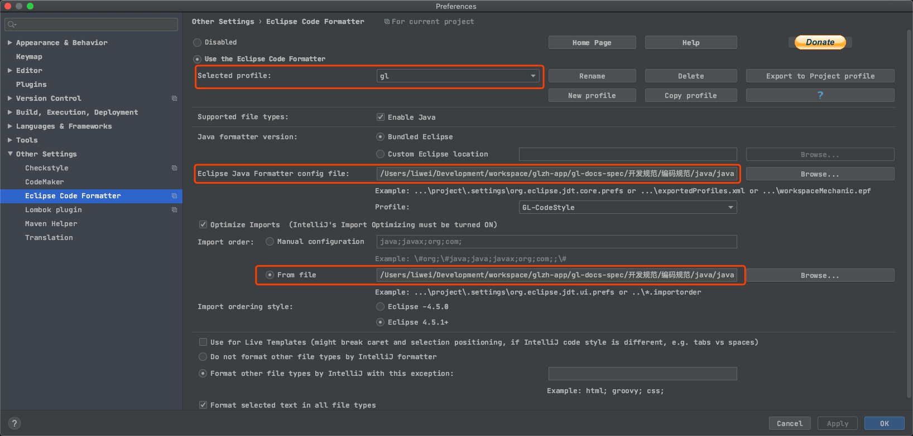

# Java 开发环境准备

## 一、配置基础环境
- [AdoptOpenJDK-11-HotSpot](https://adoptopenjdk.net/)
- Maven 3.0+ ，推荐使用 idea 自带

## 二、版本管理：git
安装参考 [git-scm](https://git-scm.com/download)

**配置 git**
打开 git 终端，输入以下命令配置用户和邮箱 (企业邮箱)
```
# 对你的 commit 操作设置关联的用户名
git config --global user.name "[name]"

# 对你的 commit 操作设置关联的邮箱地址
git config --global user.email "[email address]"
```

## 三、Idea 工具

${gl-docs-spec} 为本地 gl-docs-spec 仓库位置。所有依赖配置文件直接指向 ${gl-docs-spec} 项目本地路径以保证文件实时更新生效。

### 1. 配置格式化模板
安装格式化插件 [Idea-EclipseCodeFormatter](https://plugins.jetbrains.com/plugin/index?xmlId=EclipseCodeFormatter) ，

配置针对我们项目组的 profile->gl，所有项目选择该 profile 即可。

- 使用 `${gl-docs-spec}/编码规范/java/java-eclipse-formatter.xml` 文件进行代码格式化。

- 使用 `${gl-docs-spec}/编码规范/java/java-eclipse.importorder` 文件指定包引入顺序。



### 2. 静态代码检测

Q: 为什么设定了多种检测工具？

A: 每种类型工具侧重点不同，我们使用多种工具最终的目的就是产出高质量优质代码，从基本的坏味道代码到性能问题逐步优化。

Q: 比较苛刻、检测结果互相冲突、没有必要的检测如何处理？

A: 提交 [SonarQube 忽略规则统计表 ](https://hewppr0rxd.feishu.cn/sheets/shtcn7qYPmqcBCl3zwH0zSntxsg#4b971c) 定期进行规则更新。

#### 2.1 Idea-Analyze-Inspect Code
> Idea 自带，阿里编码规约默认集成到该检测中 「Ali-Check」

- 代码检测 Analyze -> Inspect Code
- 矩阵依赖分析 Analyze -> Dependency Matrix 良好的代码依赖应该为「倒三角模式」
- 该检测侧重点：比较全面，根据实际情况酌情解决，在检测结果合理情况下尽量解决。

#### 2.2 阿里编码规约
安装插件 [Alibaba Java Coding Guidelines](https://plugins.jetbrains.com/plugin/10046-alibaba-java-coding-guidelines) 
- 开启实时扫描 `Tools -> 阿里编码规约 -> 打开实时扫描`
- 手动分析右键分析内容-> 编码规范扫描（推荐直接使用 Idea-Analyze-Inspect Code 进行扫描）。
- 该检测侧重点：注释规范性、类命名规范、魔法值等实用性问题。

#### 2.3 SonarLint
安装插件 [SonarLint](https://plugins.jetbrains.com/plugin/7973-sonarlint) 
- 开启自动分析 `Preferences -> Tools -> SonarLint -> 勾选 Automatically trigger analysis`
- 手动分析右键分析内容-> SonarLint。
- 该检测侧重点：比较全面，一些基本的规约问题，编程过程中容易忽略的 bugs 及漏洞。

#### 2.4 SpotBugs
安装插件 [SpotBugs](https://plugins.jetbrains.com/plugin/14014-spotbugs) 该检测侧重点：bugs 、漏洞、性能、安全。

**配置插件：**
- general：安卓可添加对应安卓 Plugins，推荐打开编译分析
 


- Annotate 配置注解为：com.gaolv.annotations.SuppressFBWarnings
- filter-> includeFilterFiles 添加过滤文件：`${gl-docs-spec}/编码规范/java/spotbugs-gaolv-java.xml`
> spotbugs-gaolv-java.xml 文件内定义了 SonarQube 中 SpotBugs 扫描的规则，该规则根据实际情况阶段性更新直到达到稳定阶段。

**分析：**


#### 2.5 总体质量把控：SonarQube
我们在 CI 构建中默认集成了 SonarQube 扫描，检测规则主要为 SpotBugs + SonarLint，侧重于「Bugs」「漏洞扫描」「坏味道」扫描，请在正式提交代码前本地执行扫描后再提交。

基于以上 4 种规则的扫描结果处理后，在 SonarQube 检测结果基本可通过。

### 3. 配置头部注释
Preferences -> File and Code Templates -> Includes ，对应 Header 配置为
```
/**
 * 描述：
 *
 * @author {姓名拼音全拼} by ${DATE}
 */
```

## 四、工具插件推荐
- JetBrains 官方插件地址-[JetBrains Plugins Repository](https://plugins.jetbrains.com/)
- [Idea-Lombok](https://plugins.jetbrains.com/plugin/6317-lombok)
- [Idea-代码检测：Alibaba Java Coding Guidelines](https://plugins.jetbrains.com/plugin/10046-alibaba-java-coding-guidelines)
- [Idea-代码检测：SonarLint](https://plugins.jetbrains.com/plugin/7973-sonarlint)
- [Idea-RestfulToolkit](https://plugins.jetbrains.com/plugin/10292-restfultoolkit)
- [Idea-类调用时序图：SequenceDiagram](https://plugins.jetbrains.com/plugin/8286-sequencediagram/)
- [Idea-Mybatis 插件集合：MyBatisCodeHelperPro](https://plugins.jetbrains.com/plugin/9837-mybatiscodehelperpro)
- [Idea-控制台日志 高亮：Grep Console](https://plugins.jetbrains.com/plugin/7125-grep-console/)
- [Idea-Kubernetes](https://plugins.jetbrains.com/plugin/10485-kubernetes)
- [Idea-Selenium UI Automation Testing](https://plugins.jetbrains.com/plugin/13691-selenium-ui-automation-testing)
- [Idea-Jenkins Control Plugin](https://plugins.jetbrains.com/plugin/6110-jenkins-control-plugin) Jenkins 密码：个人 API Token，CrumbData：点击生成 [CrumbData](https://jenkins.gaolvzongheng.com//crumbIssuer/api/xml?tree=crumb#)
- [Docker-Docker for Java Developers](https://github.com/docker/labs/tree/master/developer-tools/java)
- [Docker-Live Debugging Java with Docker](https://github.com/docker/labs/tree/master/developer-tools/java-debugging)
